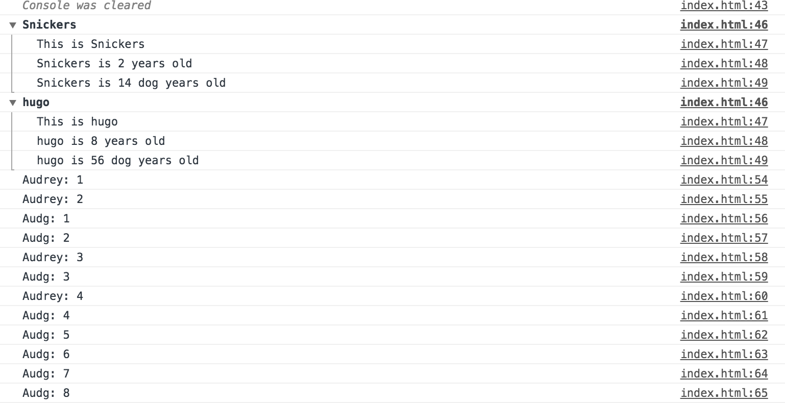

# Dev Tool Tricks

## Objective:
This is a simple dev tools exercise. We'll explore how to set break points in the browser debugger, and learn about various console methods that allow us to be more specific about the event being logged out (is it a warning, an error, a collection of data, etc.).